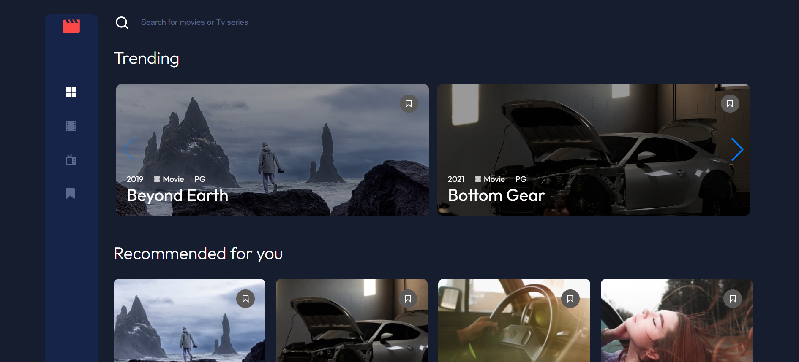

🎬 Entertainment Web App

This is a multi-page entertainment web application built with React, Redux, and SCSS. The project includes a login and sign-up system, search functionality, and state management using Redux. It follows the BEM methodology for class naming and is fully responsive across all screen sizes.

🌍 Live Demo

You can view the deployed project here: https://entertainment-film.netlify.app/

📸 Preview

Here’s a preview of the Entertainment Web App:

📌 Features

✅ Multi-page structure using React Router✅ Redux for efficient state management✅ Fully responsive design with CSS Media Queries✅ BEM methodology for structured and maintainable SCSS✅ Search functionality for filtering entertainment content✅ Authentication system – Login and Sign-up window with access control✅ Modular and reusable components with React Hooks✅ Modern UI/UX design✅ Interactive Swiper Component – Scrollable carousel for browsing movies and TV shows✅ Bookmark System – Add and remove movies/TV shows to favorites✅ Detailed Movie/TV Show Modal – Displays additional information such as rating and description upon selection

🛠️ Tech Stack

React – For building UI components

Redux – For global state management

React Router – For multi-page navigation

SCSS – For styling with BEM methodology

CSS Media Queries – For responsive design

JSON Data – For dynamic content rendering

Swiper.js – For interactive movie and TV show scrolling

🚀 Installation & Setup

Clone the repository:

git clone https://github.com/Konrad2502/Entertainment-Web-App.git
cd Entertainment-Web-App

Install dependencies:

npm install

Start the development server:

npm start

Open http://localhost:3000 in your browser to view the project.

📜 Available Scripts

npm start – Runs the app in development mode

npm test – Launches the test runner

npm run build – Builds the app for production

npm run eject – Removes CRA configurations for customization

📚 What I Learned

This project helped me deepen my knowledge of:

🎯 Redux – Managing global state efficiently across components🎯 React Router – Implementing multi-page navigation seamlessly🎯 Authentication – Implementing login and sign-up modals🎯 Reusable Components – Using hooks and props for scalability🎯 SCSS & BEM – Structuring styles for better maintainability🎯 Responsive Design – Ensuring a seamless experience on all devices🎯 Swiper.js – Implementing an interactive movie carousel for better user experience🎯 Dynamic Bookmarking – Allowing users to save and remove movies/TV shows to their favorites🎯 Detailed Movie/TV Show Modals – Enhancing user engagement with additional movie/show details

📬 Contact

If you have any questions, feel free to reach out:

🔗 GitHub: Konrad2502✉️ Email: konrad.litak@gmail.com

